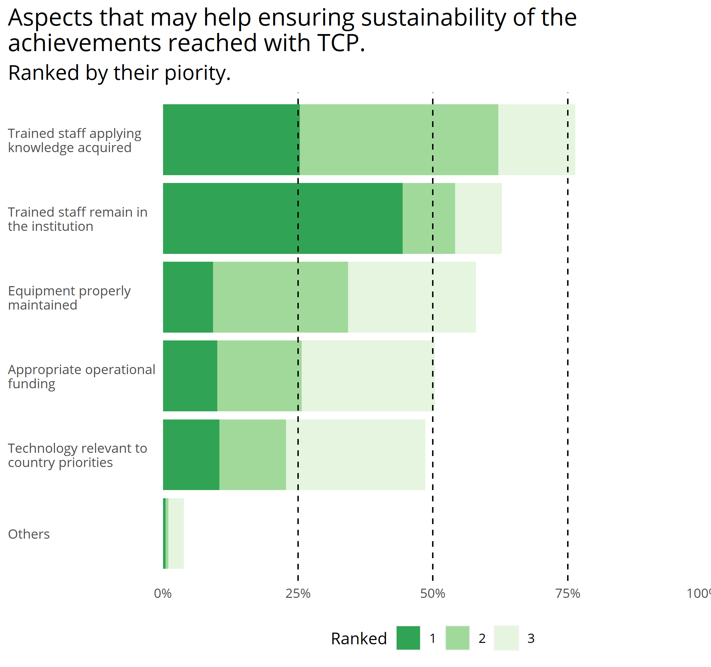
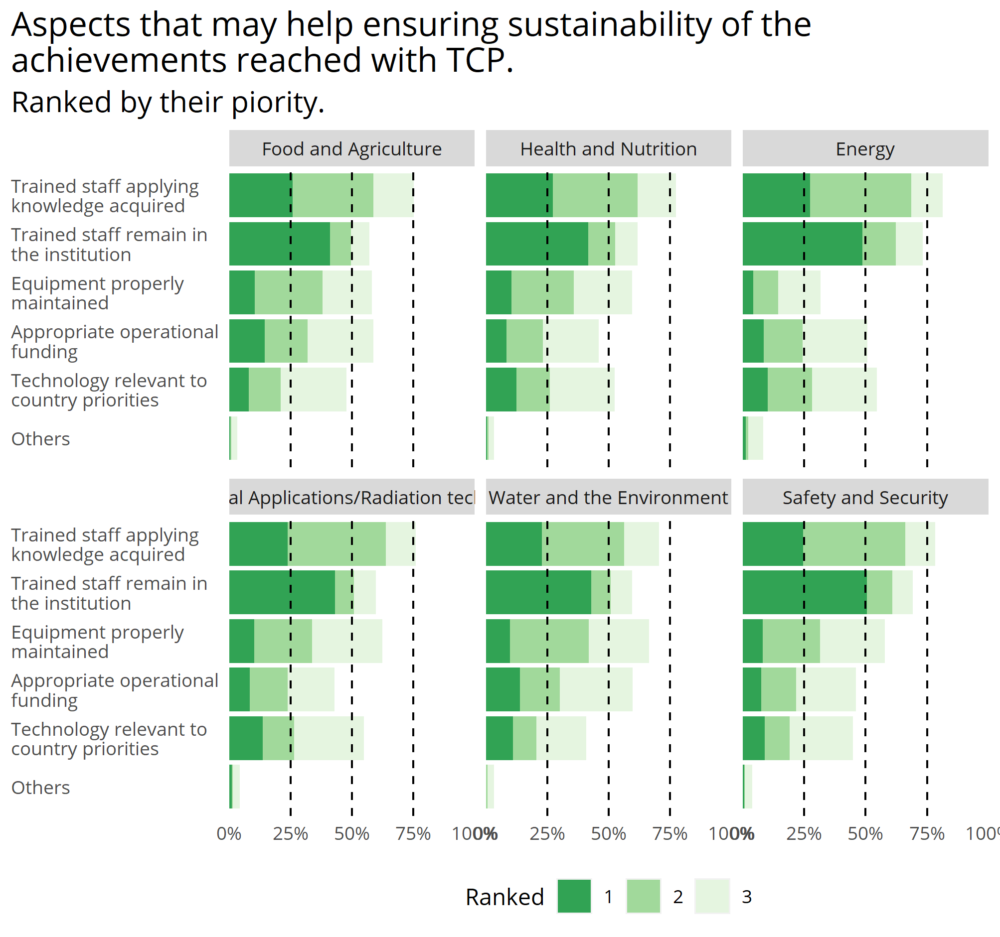

A total of 2,650 counterparts were interviewed in order to gather their
opinions abour relevant aspects of the implementation of the TCP.

Among other questions, the CPS were asked the following:

*In your opinion, what are the aspects that may help ensuring
sustainability of the achievements reached with IAEA TCP support?*

*Please RANK your 3 priority technical support needed.*

Thus, this section aims to show the perception that the CPs have about
the most effective mechanisms in which the TCP can help ensure the
sustainability of the achievement reached by the programme in their
countries.

